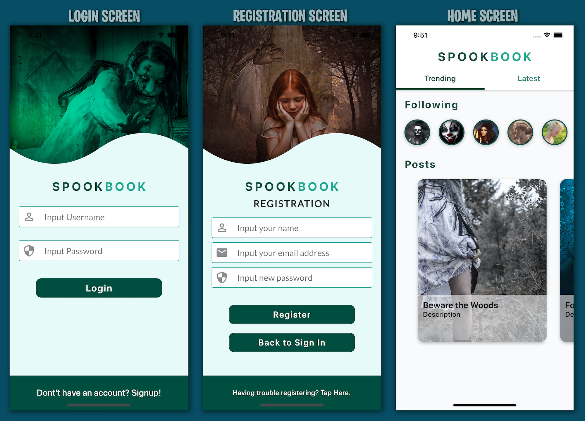

# Flutter Social User Interface

This project is programmed in Flutter and comprises a Social User Interface with Clippers. May link it upto Firebase/Firestore...

## Getting Started

### **Tools, Plugins and Resorces used to execute completion.**

* Colors Pro App (to store and determine colors)
* Sketch App (For layout of Containers and Type)
* xScope App (To keep UI dimentions accurate to the design)
* Visual Studio Code (For code editing)
* Flutter Plugin for VSCode
* Dart Plugin for VSCode
* Awesome Flutter Snippets (for the best snippet collection)
* Font Awesome Icons

### **Five Screens are provided.**

1. Login Screen
1. Registration Screen
1. Home Screen
1. Profile Screen
1. Help Screen
1. *(More screens to follow)*

### **Here are a list of resources that are used:**

* [Colors Pro](https://colors.moapp.software)
* [Sketch](https://www.sketch.com)
* [xScope](https://xscopeapp.com)
* [Visual Studio Code](https://code.visualstudio.com)
* [Font Awesome Flutter](https://pub.dev/packages/font_awesome_flutter)
* [Cookbook: Useful Flutter samples](https://flutter.dev/docs/cookbook)

## Please Fork, Like and Follow:
### If you would like to add to the project then please make a Push Request. Thanks**

