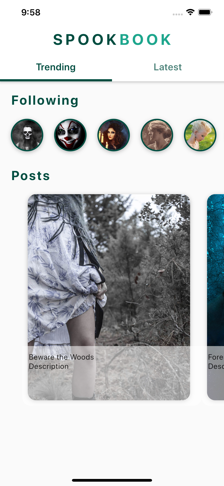

# flutter_social_ui

This project is programmed in Flutter.

## Getting Started

This project is a Social User Interface with Clippers.
 . 

A few resources to get you started if this is your first Flutter project:

- [Lab: Write your first Flutter app](https://flutter.dev/docs/get-started/codelab)
- [Cookbook: Useful Flutter samples](https://flutter.dev/docs/cookbook)

