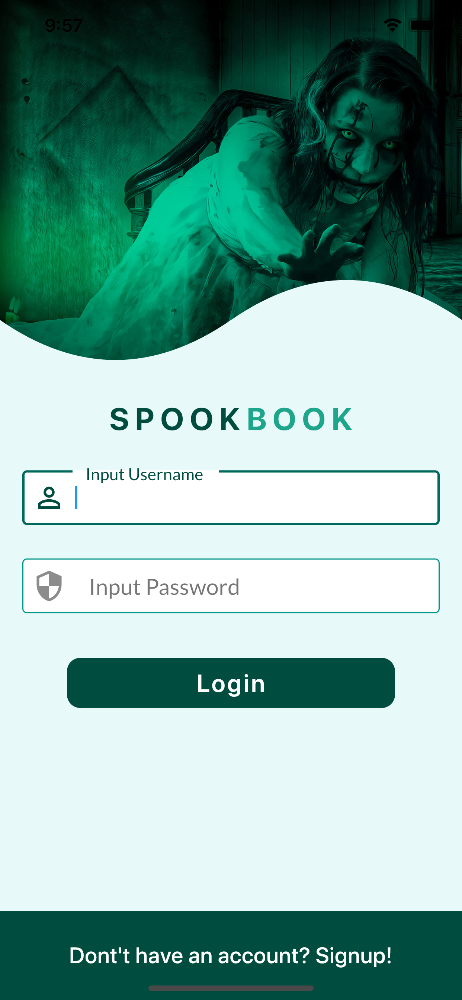

# flutter_social_ui

This project is programmed in Flutter and comprises a Social User Interface with Clippers.

## Getting Started

**Tools, Plugins and Resorces used to execute completion.**
```
    - Colors Pro App (to store and determine colors)
    - Sketch App (For layout of Containers and Type)
    - xScope App (To keep UI dimentions accurate to the design)
    - Visual Studio Code (For code editing)
    - Flutter Plugin for VSCode
    - Dart Plugin for VSCode
    - Awesome Flutter Snippets (for the best snippet collection)
    - Font Awesome Icons
```

**Four Screens are provided.**
```
    - Login Screen
    - Registration Screen
    - Home Screen
    - Profile Screen
```



**Here are a list of the above resources:**

- [Colors Pro](https://colors.moapp.software)
- [Sketch](https://www.sketch.com)
- [xScope](https://xscopeapp.com)
- [Visual Studio Code](https://code.visualstudio.com)
- [Font Awesome Flutter](https://pub.dev/packages/font_awesome_flutter)
- [Cookbook: Useful Flutter samples](https://flutter.dev/docs/cookbook)

